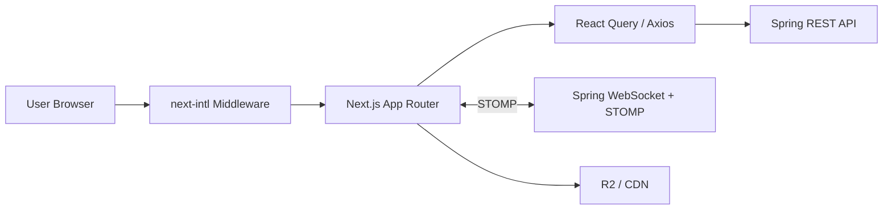

# shathing-frontend

지역 기반 물건 공유 서비스를 위한 프론트엔드 프로젝트입니다.  
`Next.js App Router`를 기반으로 공유글 탐색/작성, 인증, 보호 페이지, 다국어 라우팅, 실시간 채팅 MVP를 구현했습니다.

## 프로젝트 개요

이 프로젝트의 목적은 "필요할 때만 빌려 쓰고, 쓰지 않는 물건은 이웃과 공유한다"는 흐름을 웹 서비스로 구현하는 것입니다. 단순 게시판이 아니라 실제 서비스에 가까운 형태로 만들기 위해, 홈 랜딩부터 공유글 목록/상세/작성, 인증, 보호 레이아웃, 채팅까지 한 흐름으로 연결하는 것을 목표로 삼았습니다.

이 주제를 선택한 이유는 두 가지입니다. 첫째, 지역 커뮤니티 기반 공유는 사용 시나리오가 명확해서 제품 구조를 설계하기 좋습니다. 둘째, 프론트엔드 관점에서도 다국어 라우팅, 서버 상태 관리, 인증 가드, CDN 이미지, WebSocket/STOMP 연동처럼 실무형 문제를 한 프로젝트 안에서 다뤄볼 수 있기 때문입니다.

업무 공유 방식 측면에서는 프론트엔드 구현을 중심으로 구조 설계와 화면 개발, 상태 관리, 테스트 환경 구성을 주도했습니다. 백엔드와 맞닿는 부분은 엔드포인트, DTO, STOMP destination 같은 계약을 기준으로 맞추는 방식으로 진행했습니다.

## 기술 스택

### Frontend

- `Next.js 16`
- `React 19`
- `TypeScript`
- `Tailwind CSS v4`
- `Radix UI`

### State / Data

- `@tanstack/react-query`
- `zustand`
- `axios`

### i18n / Realtime / Infra

- `next-intl`
- `@stomp/stompjs`
- `sockjs-client`
- `Sentry`

### Testing

- `Vitest`
- `Playwright`

## 아키텍처

아래 구조로 프론트엔드, 백엔드, 실시간 채팅, 이미지 CDN을 분리했습니다.



핵심 포인트:

- `src/proxy.ts`에서 로케일 라우팅을 처리
- `src/app/[locale]/(with-layout)/(protected)/layout.tsx`에서 보호 라우트 처리
- `src/apis`와 `src/types`를 분리해 API 계층과 도메인 타입을 정리
- 채팅은 REST로 초기 데이터 조회, STOMP로 실시간 메시지 수신

## 주요 기능

### 1. 다국어 라우팅

- `/en`, `/ko` 로케일 지원
- `messages/en.json`, `messages/ko.json` 기반 번역 관리
- locale 전환 시 라우팅과 UI 문구를 함께 변경

### 2. 공유글 목록 / 상세 / 작성

- 공유글 목록 조회
- 지역 / 카테고리 필터링
- 공유글 상세 조회
- 인증 사용자만 글 작성 가능

### 3. 인증 및 보호 페이지

- 쿠키 기반 보호 페이지 가드
- 인증되지 않은 사용자는 `/auth`로 리다이렉트

### 4. 1:1 채팅 MVP

- 채팅방 목록 조회: `GET /chat/rooms`
- 메시지 조회: `GET /chat/rooms/{roomId}/messages`
- 실시간 구독: `/topic/chat/rooms/{roomId}`
- 메시지 전송: `/pub/chat/rooms/{roomId}/messages`

현재는 MVP 단계라 읽음 처리, 안 읽은 개수, 공유글 연동 채팅방, 다중 인스턴스 fan-out은 포함하지 않았습니다.

배포 URL은 현재 별도 공개하지 않았고, 로컬/개발 환경 기준으로 동작하도록 구성했습니다.

## 기여도와 역할

프론트엔드 기준으로 전체 구조 설계와 구현을 담당했습니다.

- App Router 구조 설계
- `next-intl` 기반 다국어 라우팅 구성
- 공유글 목록/상세/작성 UI 및 상태 흐름 구현
- 보호 레이아웃과 인증 분기 처리
- Spring STOMP 백엔드와 연결되는 채팅 UI 구현
- R2/CDN 이미지 로딩 처리
- Vitest / Playwright 테스트 환경 구성
- README 및 개발 환경 문서화

업무 분담 관점에서는 프론트엔드 레이어를 책임지고, 백엔드와 맞닿는 부분은 API/DTO/STOMP 스펙을 기준으로 연동하는 식으로 진행했습니다.

## 결과 및 성과

이 프로젝트를 통해 단순 화면 개발이 아니라, 실제 서비스 MVP 수준의 프론트엔드 구조를 한 번에 구성할 수 있었습니다.

- 홈 -> 공유글 -> 작성 -> 인증 -> 프로필 -> 채팅으로 이어지는 사용자 흐름 구현
- 다국어 라우팅과 보호 레이아웃을 App Router 구조 안에 안정적으로 배치
- REST + STOMP를 조합해 초기 데이터 조회와 실시간 업데이트를 분리
- Playwright / Vitest / GitHub Actions 기반 테스트 환경 마련

정량적 서비스 지표(사용자 수, 전환율, 체류 시간 등)는 아직 운영 단계가 아니라 별도로 수집하지 않았습니다. 대신 코드 구조, 기능 완성도, 확장성을 중심으로 성과를 정리했습니다.

## 그외

### 향후 계획

- 읽음 처리 / 안 읽은 메시지 개수
- 공유글과 채팅방 연동
- 메시지 무한 스크롤 및 이전 메시지 페이징
- 다중 인스턴스 환경에서의 채팅 fan-out 대응
- 채팅방 생성 UX 고도화

### 프로젝트를 통해 배운 점

- App Router에서 레이아웃 계층을 어디에 두느냐가 UX에 직접 영향을 준다는 점
- 다국어 라우팅과 보호 라우트는 초기에 구조를 잘 잡아야 이후 수정 비용이 줄어든다는 점
- 실시간 기능은 REST와 WebSocket을 분리해서 생각해야 유지보수가 쉬워진다는 점

### 개선점

- 현재 채팅방 목록/메시지 응답은 백엔드 DTO 편차를 흡수하도록 방어적으로 파싱하고 있는데, 장기적으로는 프론트/백 DTO 계약을 더 엄격히 맞추는 편이 좋습니다.
- 이미지/채팅/상세 페이지 일부는 성능 측정과 로딩 UX를 더 다듬을 여지가 있습니다.

## 실행 방법

### 설치

```bash
pnpm install
```

### 환경변수

`.env.local`

```env
# API
NEXT_PUBLIC_API_URL=http://localhost:8080

# Chat
NEXT_PUBLIC_CHAT_WS_URL=ws://localhost:8080/ws-chat
NEXT_PUBLIC_CHAT_SOCKJS_URL=
NEXT_PUBLIC_CHAT_STOMP_SUBSCRIBE_DEST_TEMPLATE=/topic/chat/rooms/{chatRoomId}
NEXT_PUBLIC_CHAT_STOMP_SEND_DEST_TEMPLATE=/pub/chat/rooms/{chatRoomId}/messages

# R2 / CDN
NEXT_PUBLIC_R2_HOST=cdn.example.com
NEXT_PUBLIC_R2_BASE_URL=https://cdn.example.com/

# Sentry
SENTRY_AUTH_TOKEN=
```

### 실행

```bash
pnpm dev
```

## 테스트

```bash
pnpm exec vitest run
pnpm e2e
```

Playwright 브라우저가 아직 설치되지 않았다면:

```bash
pnpm exec playwright install --with-deps
```
